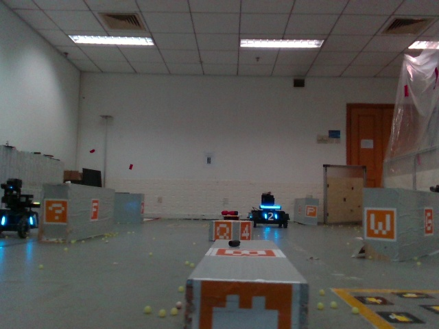

# ABCP [[arXiv](https://arxiv.org/abs/2110.03858)]

Automatic Block-wise and Channel-wise Network Pruning (**ABCP**) jointly search the block pruning policy and the channel pruning policy of the network with deep reinforcement learning (DRL). A joint sample algorithm is proposed to simultaneously generate the pruning choice of each residual block and the channel pruning ratio of each convolutional layer from the discrete and continuous search space respectively.

## ABCP code

### Code Preparations
1. Clone this repository into your local folder.
2. Prepare dataset, please refer to [Detection Datasets for ABCP](##Detection Datasets for ABCP) for detailed instructions.

## Detection Datasets for ABCP

YOLOv3 is adopted to illustrate the performance of our proposed ABCP framework. These three datasets are collected for the evaluation of ABCP.

### The UCSD dataset

    
  
The UCSD dataset is a small dataset captured from the freeway surveillance videos collected by [UCSD](http://www.svcl.ucsd.edu/projects/traffic/). This dataset involves three different traffic densities each making up about one-third: the sparse traffic, the medium-density traffic, and the dense traffic. We define three classes in this dataset: truck, car, and bus. The vehicles in the images are labeled for the detection task. The resolutions of the images are all 320×240. The training and testing sets contain 683 and 76 images respectively.

### The mobile robot detection dataset

  

    
  
The mobile robot detection dataset is collected by the robot-mounted cameras to meet the requirements of the fast and lightweight detection algorithms for the mobile robots, which is inspired [RoboMaster Univeristy AI Challenge](https://www.robomaster.com/en-US/robo/icra). There are two kinds of ordinary color camera with different resolutions which are 1024×512 and 640×480 respectively. Five classes have been defined: red robot, red armor, blue robot, blue armor, dead robot. The training and testing sets contain 13,914 and 5,969 images respectively. During collecting, we change series of exposure and various distances and angles of the robots to improve the robustness.
  
### The sim2real dataset
  

  

The sim2real detection dataset is divided into two sub-datasets: the real-world dataset and the simulation dataset. We search and train the model on the simulation dataset and test it on the real-world dataset. Firstly, we collect the real-world dataset by the surveillance-view ordinary color cameras in the field. The field and the mobile robots are the same as those in the mobile robot detection dataset. Secondly, we leverage Gazebo to simulate the robots and the field from the surveillance view. Then we capture the images of the simulation environment to collect the simulation dataset. The resolutions of images in the sim2real dataset are all 640×480. There is only one object class in these two datasets: robot. The training and testing sets of the simulation dataset contain 5,760 and 1,440 respectively, and the testing set of the real-world dataset contains 3,019 images.

### Label information 
The format of the labels is relative xywh coordinates. The documents named train.txt and test.txt list the image paths of the training dataset and the testing dataset respectively, and are used for the YOLOv3 training on Darknet.  The documents named search_train.txt and search_test.txt list the image paths and the labels of the training dataset and the testing dataset respectively, and are used for the pruning policy search. It is worth noting that the format of the labels is absolute xxyy coordinates. 
  
### Download
The data could be downloaded from [Baidu Netdisk](https://pan.baidu.com/s/1RmhjxdZqri_V5GCBnrtI5w) (Pwd: redc) and [OneDrive](https://1drv.ms/u/s!Asc-xz451d9bnSpIYWq_qetgJh5y?e=YcaGWM).
  
## Results
 
### The UCSD dataset

We search the pruning policy of YOLOv3 on the UCSD dataset and re-train the pruned model.

| Models          | mAP (%)  | FLOPs (G) | Params (M) | Inference Time (s) |
| --------------- | -------- | --------- | ---------- | ------------------ |
| YOLOv3          | 61.4     | 65.496    | 61.535     | 0.110              |
| YOLOv4          | 63.1     | 59.659    | 63.948     | 0.132              |
| YOLO-tiny       | 57.4     | 5.475     | 8.674      | **0.014**          |
|[RBCP](https://ieeexplore.ieee.org/abstract/document/9412687)| 66.5     | 17.973    | 4.844      | 0.042              |
| ABCP (Ours)     | **69.6** | **4.485** | **4.685**  | 0.016              |

The detection results of the pruned YOLOv3:

 
  
### The mobile robot detection dataset
  
We search the pruning policy of YOLOv3 on the mobile robot detection dataset and re-train the pruned model.
  
| Models      | mAP (%)  | FLOPs (G) | Params (M) | Inference Time (s) |
| ----------- | -------- | --------- | ---------- | ------------------ |
| YOLOv3      | **94.9** | 65.510    | 61.545     | 0.227              |
| YOLOv4      | 92.1     | 59.673    | 63.959     | 0.141              |
| YOLO-tiny   | 85.3     | 5.478     | 8.679      | 0.014              |
|[RBCP](https://ieeexplore.ieee.org/abstract/document/9412687)| 89.9     | 2.842     | 1.879      | 0.012              |
| ABCP (Ours) | 92.1     | **0.327** | **0.299**  | **0.003**          |
  
The detection results of the pruned YOLOv3:

 
  
### The sim2real dataset
  
We search the pruning policy of YOLOv3 on the simulation dataset and test the pruned model on the real-world dataset.
  
<table border=0 cellpadding=0 cellspacing=0 width=518 style='border-collapse:
 collapse;table-layout:fixed;width:390pt'>
 <col class=xl65 width=84 style='mso-width-source:userset;mso-width-alt:2688;
 width:63pt'>
 <col class=xl65 width=81 style='mso-width-source:userset;mso-width-alt:2602;
 width:61pt'>
 <col class=xl65 width=82 style='mso-width-source:userset;mso-width-alt:2624;
 width:62pt'>
 <col class=xl65 width=70 style='mso-width-source:userset;mso-width-alt:2240;
 width:53pt'>
 <col class=xl65 width=80 style='mso-width-source:userset;mso-width-alt:2560;
 width:60pt'>
 <col class=xl65 width=121 style='mso-width-source:userset;mso-width-alt:3882;
 width:91pt'>
 <tr height=19 style='height:14.0pt'>
  <td rowspan=2 height=38 class=xl65 width=115 style='height:28.0pt;width:63pt' align="center"><b>Models</b></td>
  <td colspan=2 class=xl65 width=163 style='width:123pt' align="center"><b>mAP (%)</b></td>
  <td rowspan=2 class=xl65 width=100 style='width:53pt'><b>FLOPs (G)</b></td>
  <td rowspan=2 class=xl65 width=110 style='width:60pt'><b>Params (M)</b></td>
  <td rowspan=2 class=xl65 width=165 style='width:91pt'><b>Inference Time (s)</b></td>
 </tr>
 <tr height=19 style='height:14.0pt'>
  <td height=19 class=xl65 style='height:14.0pt'>sim dataset</td>
  <td class=xl65>real dataset</td>
 </tr>
 <tr height=19 style='height:14.0pt'>
  <td height=19 class=xl65 style='height:14.0pt'>YOLOv3</td>
  <td class=xl66>95.6 </td>
  <td class=xl66>66.5 </td>
  <td class=xl67>65.481 </td>
  <td class=xl67>61.524 </td>
  <td class=xl67>0.117 </td>
 </tr>
 <tr height=19 style='height:14.0pt'>
  <td height=19 class=xl65 style='height:14.0pt'>YOLOv4</td>
  <td class=xl66><b>98.3</b> </td>
  <td class=xl66>28.8 </td>
  <td class=xl67>59.644 </td>
  <td class=xl67>63.938 </td>
  <td class=xl67>0.141 </td>
 </tr>
 <tr height=19 style='height:14.0pt'>
  <td height=19 class=xl65 style='height:14.0pt'>YOLO-tiny</td>
  <td class=xl66><b>98.3</b> </td>
  <td class=xl66>42.3 </td>
  <td class=xl67>5.472 </td>
  <td class=xl67>8.670 </td>
  <td class=xl67>0.014 </td>
 </tr>
 <tr height=19 style='height:14.0pt'>
  <td height=19 class=xl65 style='height:14.0pt'><a href="https://ieeexplore.ieee.org/abstract/document/9412687">RBCP<a/></td>
  <td class=xl66>97.9 </td>
  <td class=xl66>71.2 </td>
  <td class=xl67>2.321 </td>
  <td class=xl67><b>1.237</b> </td>
  <td class=xl67>0.009 </td>
 </tr>
 <tr height=19 style='height:14.0pt'>
  <td height=19 class=xl65 style='height:14.0pt'>ABCP (ours)</td>
  <td class=xl66>98.0 </td>
  <td class=xl66><b>76.1</b> </td>
  <td class=xl67><b>1.581</b> </td>
  <td class=xl67>2.545 </td>
  <td class=xl67><b>0.008</b> </td>
 </tr>
</table>

The detection results of the pruned YOLOv3 on the real-world dataset:

  
